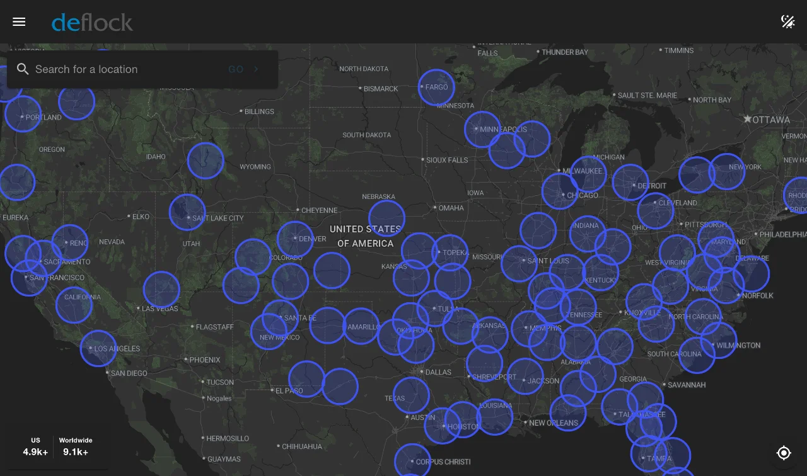

# DeFlock

Crowdsourced tool for locating and reporting ALPRs. [View Live Site](https://deflock.me).

## Purpose

I created this project after noticing the mass deployment of ALPRs in cities, towns, and even rural areas in the recent years. It's a massive threat to privacy, and this projects helps shed a light on this issue as ALPRs continue to be deployed to thousands of cities across the US and possibly beyond.

## What it Does

### View ALPRs on a Map
Uses OpenStreetMap data to populate a map with crowdsourced locations of ALPRs, along with their type and direction they face.

### Report ALPRs
Provides OSM tags for easy reporting of ALPRs based on brand on OSM's editing site. Evemtually, this will be a native feature of the site.

### Learn About ALPRs
See photos of common ALPRs and learn about their capabilities.

## Tech Stack

_Likely to change soon._

### Backend
* Scala
* PekkoHTTP
* Nginx

### Cloud
* AWS Lambda (for [clustering](serverless/alpr_clusters) and [counts](serverless/alpr_counts))
* AWS S3
* AWS ECR

### Frontend
* Vue3
* Vuetify (UI component library)
* Vue Leaflet (mapping library)

### Services
* OpenStreetMap - Overpass API
* Nominatim - Geocoding
* Stadia Maps - Map Tiles

## Usage

### Requirements
* node/npm
* scala/sbt

### Running Frontend

1. `cd webapp`
2. `npm i`
3. `npm run dev`

### Running Backend

1. `cd shotgun`
2. `sbt run`

## Contributing

We welcome contributions from anyone. Here's how you can help:

### How to Contribute

1. Fork the Repository
2. Make Your Changes
3. Open a Pull Request against This Repo
